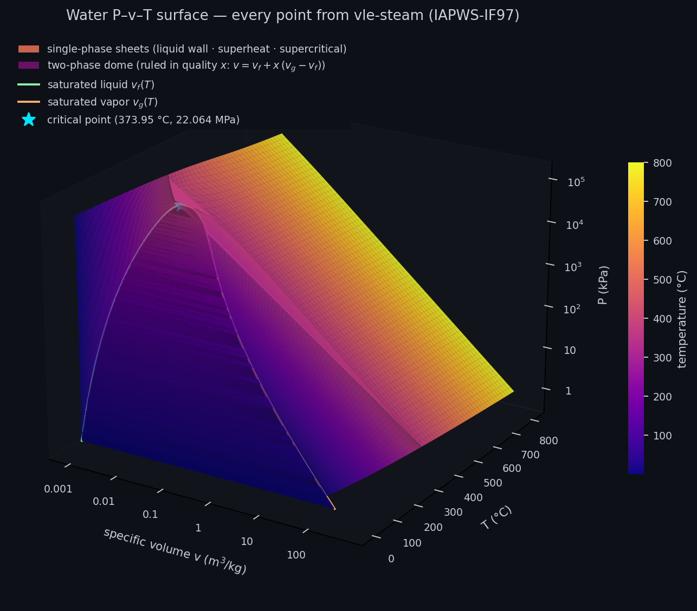

# VLE — Vapor-Liquid Equilibrium Calculator

A modern Rust + Python reimplementation of a multicomponent vapor-liquid equilibrium (VLE) thermodynamic calculator, built from two legacy academic codebases using AI-assisted development.


*Every point above was computed by this library's Rust engine — the **phase-envelope dome** (left) traced through each mixture's critical point by Michelsen continuation, with the critical locus from the Heidemann–Khalil solver riding the ridge, and the **P–x–y "sail"** (right) from the γ-φ bubble/dew solvers. Explore and regenerate them in [`notebooks/09_3d_phase_surfaces.ipynb`](notebooks/09_3d_phase_surfaces.ipynb).*



*The classic **P–v–T surface of water** — 36,000+ state points, every one evaluated by this repo's `vle-steam` crate (IAPWS-IF97). Legend: the bright sheets are the single-phase regions (the near-vertical **liquid wall**, the sweeping **superheat sheet**, and the supercritical region joining them above T<sub>c</sub>); the darker inset is the **two-phase dome**, a ruled surface swept in quality x between the saturated-liquid (green) and saturated-vapor (orange) boundary curves, which merge at the **critical point** (★, 373.95 °C / 22.064 MPa). Color encodes temperature. Build it step by step in [`notebooks/14_pvt_surface.ipynb`](notebooks/14_pvt_surface.ipynb), or regenerate this image with [`scripts/render_pvt_hero.py`](scripts/render_pvt_hero.py).*

**Why steam is here at all:** water properties are the one calculation this project ships that does *not* come from the research papers it modernizes — they earned their place through practice. In industry, multicomponent VLE almost always lives inside a process simulator; but alongside it, every practicing engineer keeps a steam-table utility within reach, and those utilities are built on **IAPWS-IF97**, the formulation the [International Association for the Properties of Water and Steam](https://iapws.org/faqs/faq2) maintains as the international standard of the steam power industry ([R7-97(2012)](https://iapws.org/documents/release/IF97-Rev)) — adopted by ASME for its [official steam tables](https://www.asme.org/publications-submissions/books/find-book/steam-properties-industrial-use-based-iapws-if97-professional-version) and used for turbine contracting and acceptance testing. The same water-property formulations sit inside the thermal-hydraulics codes behind nuclear and fossil power plants (e.g. [RELAP-7](https://www.degruyterbrill.com/document/doi/10.3139/124.110802/html) and [TRACE](https://www.sciencedirect.com/science/article/abs/pii/S0306454920304527)), where steam drives the turbines that generate electricity. `vle-steam` implements IF97 directly — all five regions plus the saturation line — so this "VLE for water only" companion gives every energy balance in the stack a reference-quality water model.

## About This Project

This project modernizes legacy thermodynamic software — originally written in VB6 (1999) and Pascal (1989) — into a fast **Rust computation engine** with **Python bindings** (via PyO3) and **Jupyter notebooks** for interactive exploration.

**This is an educational project** demonstrating how AI coding tools like [Claude Code](https://claude.ai/code) can be used to understand, analyze, and modernize legacy scientific code. The entire modernization process — from analyzing ~17,500 lines of VB6/Pascal, mapping algorithms to academic references, proposing performance improvements, and planning the new architecture, through implementing and validating the full Rust engine and its Python bindings — was conducted with Claude Code as a development partner.

### Original Research

This work is based on the thesis:

> **"Desarrollo de un Programa Computacional para el Cálculo del Equilibrio Líquido Vapor de Mezclas Multicomponentes bajo el Ambiente Windows"**
>
> *Miguel Roberto Jackson Ugueto* and *Carlos Fernando Mendible Porras*
>
> Proyecto de Grado, Universidad Simón Bolívar, Sartenejas, April 1999
>
> Advisors: Prof. Coray M. Colina and Prof. Jean-Marie Ledanois

The VB6 program in turn builds upon an earlier Pascal package:

> **(4)** Da Silva, F. A.; Báez, L. Desarrollo de un Paquete Computacional para la Predicción de Propiedades Termodinámicas y de Equilibrio de Fases. Thesis, Universidad Simón Bolívar, 1989.

The full research paper is available in both [English](docs/en/research-paper/README.md) and [Spanish](docs/es/research-paper/README.md) in the `docs/` directory.

## Features

### Thermodynamic Models
- **22+ cubic equations of state**: Peng-Robinson, RKS, van der Waals, Schmidt-Wenzel, Patel-Teja, and 17 more variants
- **Chao-Seader** liquid fugacity correlation (with special H2/methane handling)
- **Second virial equation** (Pitzer/Tsonopoulos correlation)
- **6 activity coefficient models**: NRTL, Wilson, van Laar, Margules, Scatchard-Hildebrand, Ideal
- **11 mixing rules**: Classical (IVDW, IIVDW), Wong-Sandler, Huron-Vidal (original + simplified), MHV1, MHV2, plus 3 C-parameter rules for the three-parameter EOS — all with **exact composition derivatives** (analytic or dual-number AD, never finite differences)

### Calculations
- Bubble point (temperature and pressure)
- Dew point (temperature and pressure)
- Isothermal flash (Rachford-Rice via Halley in the Leibovici–Neoschil window; tangent-plane stability analysis)
- Adiabatic flash
- Phase-envelope continuation through the critical point (Michelsen)
- Mixture critical point (Heidemann-Khalil algorithm)
- Binary interaction parameter regression (kij)
- Activity model parameter regression (Aij) with analytical Jacobians
- Saturation pressure (Antoine, Riedel, Muller, RPM)
- Residual and excess thermodynamic properties (H, S, G)

### Units of Measurement (Independent Add-On)
- **Dimensional analysis** via the 7 SI base dimensions (L, M, T, I, Θ, N, J)
- **Rust**: `uom` crate for compile-time dimension checking (zero runtime cost)
- **Python**: `pint` library for runtime unit conversion
- Supports temperature (K, °C, °F, °R), pressure (kPa, bar, atm, psi, mmHg, torr), energy (kJ/kmol, J/mol, cal/mol, BTU/lbmol), and more
- Works standalone — can be used in other projects

### Steam Tables — `vle-steam` (Independent Add-On)
- **IAPWS-IF97** industrial water/steam properties — "VLE for water only", the reference standard behind every printed steam table
- All five IF97 regions + the saturation line (closed-form `Psat(T)` / `Tsat(P)`) + region-1 backward equations, verified against the R7-97(2012) tables to 9 significant figures
- The practitioner state API: `Water(T,P)` / `(T,x)` / `(P,x)` / `(P,h)` / `(P,s)`, saturation-table rows, latent heat, two-phase quality
- **Python**: `vle.steam` with pint/gauge-pressure inputs and a batch numpy API; **Rust**: dependency-free crate (pure `f64`, FFI/embedded-friendly)

### Algorithm Improvements Over Legacy Code
The modernization introduces several numerical improvements over the original VB6/Pascal implementations. This table is the **original improvement plan proposed by Claude Opus 4.6** during the initial legacy-code analysis (Milestone 0):

| Algorithm | Legacy | Modernized | Benefit |
|-----------|--------|-----------|---------|
| NR Jacobian | Full numerical (m+1 evals/step) | Broyden quasi-Newton (1 eval/step) | ~25x fewer evaluations |
| kij optimization | Golden section (linear) | Brent's method (superlinear) | ~2x fewer iterations |
| Root finding | Regula Falsi (can stall) | Illinois / Brent's | No stalling, superlinear |
| dα/dT derivatives | 5-point numerical stencil | Analytical for all 22+ EOS | Eliminates 4 evals/call |
| Excess enthalpy | Numerical dGE/dT | Analytical for all 5 models | No cancellation errors |
| Rachford-Rice | Newton-Raphson (quadratic) | Halley's method (cubic) | Faster convergence |
| Critical point | Numerical Helmholtz derivatives | Analytical (2-param EOS) | Dominant cost eliminated |

The plan was later expanded into [PERFORMANCE_PROPOSAL.md](docs/plans/engine/PERFORMANCE_PROPOSAL.md) — the "numpy for thermo" strategy adding the **exact-derivative mixture core** (analytic + `num-dual` dual-number AD, replacing every finite difference), the modern Michelsen flash suite (stability analysis, windowed Halley Rachford-Rice, phase-envelope continuation), a measured performance foundation, and the upcoming batch numpy API — and implemented, largely by Claude Fable 5, in Milestones 8.2–9. In the final architecture the exact analytic/AD Jacobians go further than the Broyden row above: full Newton uses them directly, with Broyden demoted to a fallback. See [MODERNIZATION_PLAN.md](docs/plans/MODERNIZATION_PLAN.md) for full details and justifications.

**The table above is kept as written in April 2026 — it is the plan, not a description of today's engine.** A great deal changed on the way here. Some rows were superseded (Broyden was demoted to a fallback the moment exact analytic/AD Jacobians landed). Whole tracks were added that the original analysis never imagined — a generalized mixture core, IAPWS-IF97 steam tables, three foreign-language bindings. And in July 2026 an **external performance audit** re-examined the engine and produced numbers nobody had guessed: some of its textbook-correct recommendations made this code measurably *slower* and were reverted, while measuring the layer *underneath* one of them found a 10× win and a latent correctness bug. Every plan and audit behind those changes — what it decided, what shipped, and what was rejected and why — is catalogued in **[docs/plans/README.md — the Plan & Audit History](docs/plans/README.md)**.

## Install

`vle-thermo` is **published** on two registries — PyPI for Python, crates.io
for Rust. Both track the same version and are built from the same source tree.
Every other way to use the engine ships as source plus a build script; see
*Other ways to use the engine* below.

### Python (PyPI)

```sh
pip install vle-thermo
```

Distribution name is `vle-thermo`, import name is `vle` (like Pillow → PIL):

```python
import vle
```

Optional extras: `pip install "vle-thermo[plot]"` (matplotlib),
`"vle-thermo[db]"` (extended component-database seeding via `thermo`).
See [python/README.md](python/README.md).

#### Quickstart

Build a system from component names (critical constants come from the bundled
database), then flash it. Temperatures are **K** and pressures **kPa absolute**
by default, but any input accepts a unit-aware value:

```python
from vle import System
from vle.units import Q_

# n-heptane / n-butane with the RKS equation of state (Chapter IV, Table 4.10).
sys = System(["n-heptane", "n-butane"], eos="RKS")

res = sys.flash_pt(300.0, 100.0, z=[0.5, 0.5])     # or flash_pt(Q_(26.85, "degC"), "1 bar", ...)
print(res.beta, res.x, res.y)                        # vapor fraction, liquid & vapor comps

# The batch API is the "numpy for thermo" path: one FFI crossing per array,
# GIL released, parallel across cores, warm-started along the sweep.
import numpy as np
ts = np.linspace(290.0, 340.0, 100_000)
out = sys.flash_pt_batch(ts, ps=np.array([100.0]), z=[0.5, 0.5])   # ~10× a Python loop
print(out.beta.shape, out.converged.sum())
```

A full guided tour — installation, the `System` API, unit handling, the batch
API, and plotting — is in [`notebooks/01_introduction.ipynb`](notebooks/01_introduction.ipynb).

### Rust (crates.io)

```sh
cargo add vle-thermo
# Optional: the companion units crate for gauge pressure / °C / psi parsing
cargo add vle-units
# Optional: IAPWS-IF97 steam tables (dependency-free, "VLE for water only")
cargo add vle-steam
```

API docs: <https://docs.rs/vle-thermo>. See [engine/README.md](engine/README.md)
and [steam/README.md](steam/README.md).

### Other ways to use the engine

The same Rust core also compiles into **Swift** (iOS/macOS), **Kotlin**
(Android and — via Compose Multiplatform — Windows desktop) and
**WebAssembly** (a React site where the thermodynamics runs client-side, or
the same bundle wrapped by Tauri, Electron or Capacitor). It also ships **19
notebooks** that reproduce the source thesis's Chapter IV results.

None of those are published as binaries, by design — the repo distributes the
build recipe, and one script per target produces the artifact locally:

```sh
git clone https://github.com/miguelju/vle.git && cd vle
scripts/build-ios.sh       # → swift/VleThermo    (add as a local package in Xcode)
scripts/build-android.sh   # → kotlin/VleThermo   (open kotlin/ in Android Studio)
scripts/build-wasm.sh      # → wasm/pkg           (npm install <path-to-vle>/wasm/pkg)
```

Every one of those channels — the notebooks, all three languages, the
per-platform guides, and the C#/.NET route that was evaluated and parked — is
documented in **[distribution/README.md](distribution/README.md)**.

Release process and registry maintenance: [PUBLISHING.md](PUBLISHING.md).

## Project Structure

```
vle/
├── data/                    # Component property database
│   └── components.db        # SQLite database (generated, gitignored)
├── scripts/                 # Data extraction utilities (see scripts/README.md)
├── python/src/vle/          # Python package
│   ├── system.py            # High-level vle.System API (persistent handle, unit-aware)
│   ├── components.py        # Bundled JSON component DB loader (name-based lookup)
│   ├── results.py           # Result dataclasses (Flash/Bubble/Dew/Critical + batch)
│   ├── plots.py             # Pxy / Txy / phase-envelope helpers (matplotlib)
│   ├── data/               # Bundled components.json (ships in wheel)
│   ├── db/                  # Component database (connection, queries, models)
│   │   └── sql/             # Bundled schema.sql + seed_chapter4.sql (ship in wheel)
│   └── cli/                 # CLI tool (vle-db)
├── notebooks/               # 20 Jupyter notebooks (00–14 + 01_introduction + index; see distribution/NOTEBOOKS.md)
│   └── data/                # Pre-computed 3-D surface datasets (CSV, committed)
├── units/                   # Independent units crate (dimensional analysis, gauge pressure, custom units)
├── steam/                   # Independent steam-tables crate `vle-steam` (IAPWS-IF97, dependency-free; M13)
├── engine/                  # Rust computation engine (complete: 22+ EOS, mixture core, flash suite, PyO3 bindings)
│   └── data/                # Canonical components.json — bundled Rust DB via the `component-db` feature (M12.2)
├── ffi/                     # UniFFI wrapper crate `vle-ffi` — Swift + Kotlin (never published; M15/M16)
├── wasm/                    # wasm-bindgen wrapper crate `vle-wasm` — JavaScript/TypeScript (never published; M17)
├── swift/VleThermo/         # Local Swift package for iOS/macOS apps (XCFramework generated by scripts/build-ios.sh)
├── kotlin/VleThermo/        # Local Android/Kotlin library module (bindings + .so generated by scripts/build-android.sh)
├── docs/
│   ├── plans/               # Every plan & audit — README.md is the Plan & Audit History
│   │   ├── MODERNIZATION_PLAN.md   # 27-phase implementation plan (the one live plan)
│   │   ├── engine/          # Calculation plans + audits (performance, steam, NRTL, petroleum)
│   │   └── delivery/        # Platform plans (iOS, Android/Kotlin, Web/wasm)
│   ├── en/research-paper/   # English translation (navigatable)
│   ├── en/units/            # Units add-on design document
│   ├── en/ios/              # Rust→Swift FFI learning guide + build instructions (M15)
│   ├── en/android/          # Rust→Kotlin FFI guide — Android + Compose Desktop (M16)
│   ├── en/web/              # Rust→JavaScript guide — WebAssembly for React/Tauri/Electron/Capacitor (M17)
│   ├── en/dotnet/           # C#/.NET route — documented, version-blocked as of 2026-07-12
│   └── es/research-paper/   # Spanish original (pdf/ + markdown/)
├── legacy/
│   ├── vb6/                 # Original VB6 source (~15,000 lines, reference)
│   └── pascal/              # Original Pascal source (~2,500 lines, reference) (4)
├── deploy/                  # Registry publishing only (PyPI + crates.io)
├── distribution/            # Every non-registry channel (notebooks, Swift, Kotlin, wasm)
├── ROADMAP.md               # Milestones and progress tracking
├── TODO.md                  # Tasks with time estimates
├── PASCAL_VB6_COMPARISON.md # Legacy codebase comparison
├── PUBLISHING.md            # Release process (tag → PyPI + crates.io)
└── CLAUDE.md                # Claude Code development guidance and conventions
```

## Development Workflow

This project is developed incrementally using [Claude Code](https://claude.ai/code) as an AI development partner. Each milestone follows a **plan-then-execute** cycle, tracked across three synchronized documents. Every plan and audit ever written for this project — including the ones whose recommendations were measured and *rejected* — is catalogued in the [Plan & Audit History](docs/plans/README.md).

| Document | Purpose |
|----------|---------|
| [`ROADMAP.md`](ROADMAP.md) | Milestones — high-level goals and deliverables |
| [`TODO.md`](TODO.md) | Tasks — actionable items with time estimates per milestone |
| [`docs/plans/MODERNIZATION_PLAN.md`](docs/plans/MODERNIZATION_PLAN.md) | Phases — detailed technical implementation plan (27 phases) |
| [`OPTIMIZATION_PLAN_PART1.md`](docs/plans/engine/OPTIMIZATION_PLAN_PART1.md) | Flash-layer performance work — measured baseline, per-recommendation verdicts, results (incl. two optimizations rejected *because* they benchmarked slower) |
| [`OPTIMIZATION_PLAN_PART2.md`](docs/plans/engine/OPTIMIZATION_PLAN_PART2.md) | Mixture-core performance work — the per-(T,P) cache, activity/virial matrix caching, and the `&dyn Fn`-in-the-n²-loop finding the audit missed |
| [`OPTIMIZATION_AUDIT_HISTORY.md`](docs/plans/engine/OPTIMIZATION_AUDIT_HISTORY.md) | Provenance of the external audit (Gemini prompt → Codex audit → Claude second-audit) and what AI-reviewing-AI got right and wrong |
| [`docs/plans/README.md`](docs/plans/README.md) | **Plan & Audit History** — every plan and audit, clickable, with its status and the era it belongs to |

### Resuming work from a new machine

```bash
# 1. Clone the repository
git clone <repo-url> && cd vle

# 2. Review current progress
cat ROADMAP.md          # Which milestones are done?
cat TODO.md             # Which tasks remain?

# 3. Initialize the component database (generated, not in git)
pip install thermo                                          # optional, for extended seeding
PYTHONPATH=python/src python -m vle.cli.main init
PYTHONPATH=python/src python -m vle.cli.main seed --source chapter4
PYTHONPATH=python/src python -m vle.cli.main validate chapter4

# 4. Start a Claude Code session and continue the next milestone
claude
```

### How a milestone is executed

1. **Plan** — Claude Code reads the relevant legacy code, documentation, and academic references, then proposes an implementation plan.
2. **Review** — The developer reviews the plan, asks questions, and requests adjustments.
3. **Execute** — Claude Code implements the plan incrementally (code, tests, documentation).
4. **Validate** — Results are verified against Chapter IV test cases (8 validation systems from the thesis).
5. **Commit** — All documentation (`ROADMAP.md`, `TODO.md`, `MODERNIZATION_PLAN.md`) is updated to reflect the current state before pushing.

Each milestone records which AI model was used (e.g., `Claude Opus 4.6 (1M context)`, `Claude Fable 5`) in the commit and documentation for reproducibility tracking — see the model history in [Built with Claude Code](#built-with-claude-code) below.

### Project conventions

- All code, documentation, and project management follow the rules in [`CLAUDE.md`](CLAUDE.md).
- Every function that accepts or returns a physical quantity documents the units in its doc comment.
- All internal calculations use **absolute** pressure in **kPa** — never gauge pressure.
- Phase numbering in `MODERNIZATION_PLAN.md` always matches milestone execution order.

## Getting Started

**Status**: Milestones 0–17 are **complete** (M16's Android module is code-complete,
pending its first Android Studio run). The model surface is finished and validated
against the thesis's published Chapter IV tables — 22 cubic EOS, 6 activity models,
11 mixing rules, the full flash suite with exact derivatives, IAPWS-IF97 steam
tables, a 25-compound database, 291 Rust + 450 Python tests and 19 executable
notebooks. The remaining `0.` in the version number is about **API** stability,
not the numerics. The full engine (22+ EOS, mixing rules with exact derivatives, energy properties, and the modern flash/regression suite), the high-level `vle.System` Python API with a parallel batch numpy layer, and 19 notebooks — all validated against the thesis's Chapter IV tables. Latest release: **v0.12.1** on PyPI + crates.io — a documentation release (every plan and audit moved to [docs/plans/](docs/plans/README.md), with a [Plan & Audit History](docs/plans/README.md) as the entry point; no code change). **v0.12.0** was a performance release (isothermal flash −24…−28 %, tangent-plane stability −44…−51 %) responding to an external audit, with the measured verdicts and the rejected recommendations recorded in [OPTIMIZATION_PLAN_PART1.md](docs/plans/engine/OPTIMIZATION_PLAN_PART1.md) and [OPTIMIZATION_PLAN_PART2.md](docs/plans/engine/OPTIMIZATION_PLAN_PART2.md); **v0.10.0** shipped the steam tables. **Milestones 15–17** add the local-build app channels — **Swift** (iOS/macOS via UniFFI), **Kotlin** (Android + Compose Desktop via UniFFI; code complete, first Android Studio run pending), and **WebAssembly** (browser / Tauri / Electron / Capacitor via wasm-bindgen) — nothing published or committed as a binary, one build script each (`scripts/build-{ios,android,wasm}.sh`). **Milestone 14** adds the **NRTL** activity model (general multicomponent, with analytic ∂lnγ/∂T and excess enthalpy via dual-number AD) and **ammonia** to the bundled database (now 25 compounds) — the upstream liquid model the downstream `stages-thermo` library needs for the ammonia–water enthalpy–composition method (notebook `13_nrtl_ammonia.ipynb`). **Milestone 13** adds a new dependency-free crate **`vle-steam`** implementing the **IAPWS-IF97** industrial steam tables ("VLE for water only") — all five regions + the saturation line + backward equations, verified against the R7-97(2012) tables to 9 significant figures — surfaced as **`vle.steam`** with unit-aware inputs and a batch numpy API (notebook `12_steam_tables.ipynb`). **Milestone 12** — the downstream derivative & database release — is done across two releases: **v0.8.2** grew the bundled database to **24 compounds** with ideal-gas Cp°/R coefficients; **v0.9.0** added a Rust-side component database (`vle_thermo::db`, `component-db` feature), **exact temperature/pressure derivatives** of fugacity and K-values (dual-number AD), **real-mixture heat capacity** and **partial molar enthalpy**, and a packaged γ-φ phase enthalpy — the property surface a downstream staged-separation library consumes. **v0.9.1** is a patch fixing a ~1% Wong-Sandler departure-enthalpy inconsistency that the M12.3 Gibbs–Helmholtz invariant surfaced (root cause + fix in [DERIVATIVE_RELEASE_PLAN.md](docs/plans/engine/DERIVATIVE_RELEASE_PLAN.md) §7). See [DERIVATIVE_RELEASE_PLAN.md](docs/plans/engine/DERIVATIVE_RELEASE_PLAN.md). Per-milestone detail: [ROADMAP.md](ROADMAP.md).

### Prerequisites
- Python 3.10+
- Rust 1.85+ with cargo (only if building the engine from source)
- maturin (for building PyO3 bindings from source)

### Component Database
```bash
PYTHONPATH=python/src python -m vle.cli.main init               # Create database
PYTHONPATH=python/src python -m vle.cli.main seed --source chapter4  # Seed 25 compounds
PYTHONPATH=python/src python -m vle.cli.main list               # Browse components
PYTHONPATH=python/src python -m vle.cli.main show methane       # View details
```

### Build (from source)
```bash
conda activate vle                    # Or your own Python 3.10+ environment
cargo build --release                 # Build the Rust workspace (engine + units)
cargo test --workspace                # Run the Rust test suite
(cd python && maturin develop --release)  # Build + install the Python bindings
python -c "import vle; print(vle._engine.version())"  # Verify
pytest python/tests/                  # Run the Python test suite
```

## Documentation

- [Developer Setup Guide](docs/en/SETUP.md) — Prerequisites, build instructions, and development workflow (Rust, Python/conda, maturin)
- [Mixing Rules — A Student's Guide](docs/en/mixing-rules.md) — What mixing rules are, the classical vs EOS/Gᴱ families, how to choose one, and the 11 rules implemented here
- [Dimensional Analysis](docs/en/units/dimensional-analysis.md) — Units add-on design: SI dimensions, gauge pressure, extensible unit registry
- **[Plan & Audit History](docs/plans/README.md)** — **Start here for the "why".** Every plan and audit the project has produced, in two clickable tables (calculations vs. delivery), with what each one decided, whether the code caught up with it, and the five eras they arrived in
- [Modernization Plan](docs/plans/MODERNIZATION_PLAN.md) — Full technical plan with academic references, algorithm mapping, and performance improvements
- [Performance Proposal](docs/plans/engine/PERFORMANCE_PROPOSAL.md) — The speed/convergence plan (2026-07): modern flash algorithms, exact-derivative core, batch numpy API
- [Optimization Plan — Part 1](docs/plans/engine/OPTIMIZATION_PLAN_PART1.md) — The flash layer's response to the external audit: what the benchmarks actually said, which recommendations were executed, and which two were reverted for making it slower
- [Optimization Plan — Part 2](docs/plans/engine/OPTIMIZATION_PLAN_PART2.md) — The mixture core: caching composition-independent work per (T, P), and why the audit's square-root hoist barely mattered next to a trait object sitting n²-deep in the same loop
- [Optimization Audit History](docs/plans/engine/OPTIMIZATION_AUDIT_HISTORY.md) — A learning-repo write-up of using one AI to audit another's plan: the chain of custody, and why a reviewer that can't run `cargo bench` can't calibrate its own advice
- [Pascal vs VB6 Comparison](PASCAL_VB6_COMPARISON.md) — Detailed comparison of the two legacy codebases
- [Distribution](distribution/README.md) — Notebooks, Swift, Kotlin and WebAssembly: the channels that ship as source plus a build script. Registry publishing (PyPI, crates.io) is in [deploy/README.md](deploy/README.md)
- [Research Paper (English)](docs/en/research-paper/README.md) — Navigatable English translation
- [Research Paper (Spanish)](docs/es/research-paper/README.md) — Original Spanish text (PDFs)

## Academic References

The implementation cites 30 academic references (ACS format). Key ones include:

- **(4)** Da Silva, F. A.; Báez, L. Thesis, Universidad Simón Bolívar, 1989. — Pascal codebase origin
- **(5)** Abbott, M. M. In *Equations of State in Engineering and Research*; ACS, 1979. — General cubic EOS form
- **(9)** Müller, E.; Olivera Fuentes, C.; Estévez, L. *Lat. Am. Appl. Res.* **1989**, *19* (2), 99. — Multicomponent fugacity
- **(16)** Heidemann, R. A.; Khalil, A. M. *AIChE J.* **1980**, *26* (5), 769. — Critical point algorithm
- **(19)** Michelsen, M. L. *Fluid Phase Equilib.* **1982**, *9*, 21. — Rachford-Rice / phase split
- **(21)** Orbey, H.; Sandler, S. I. Cambridge University Press, 1998. — Advanced mixing rules

The full reference list and code mapping is in [MODERNIZATION_PLAN.md](docs/plans/MODERNIZATION_PLAN.md#academic-references).

## Built with Claude Code

**This entire project was built with [Claude Code](https://claude.ai/code)**, Anthropic's CLI coding agent. Every aspect — from analyzing 20,000 lines of legacy code to writing this README — was done collaboratively between a human developer and an AI agent working directly in the terminal.

### Model history

The project spans several generations of Claude models, and each milestone records which one executed it (in `ROADMAP.md`, `TODO.md`, and the commit trailers):

| Model | Milestones | Contribution |
|---|---|---|
| **Claude Opus 4.6** (1M context) | 0–2 | Foundation: legacy-code analysis, reference mapping, English translation, repo structure, the modernization plan |
| **Claude Opus 4.7** (1M context) | 3–6 | Units add-on, component database, CI/CD + publishing pipeline, numerics layer |
| **Claude Opus 4.8** (1M context) | 7–8.1 | The full pure-component EOS zoo (22+ α variants, 3-parameter EOS, saturation models, virial) and the activity-coefficient models |
| **Claude Fable 5** | 8.2–9 | **The major performance & algorithm modernization**: the measured performance foundation (benches, allocation-free hot paths, caches), the generalized (A, B, U, W) mixture core with **exact analytic/dual-number derivatives** replacing every finite difference, mixture energy properties, and the complete modern flash suite — stability analysis, guaranteed-convergence Rachford-Rice, bubble/dew, adiabatic flash, Heidemann–Khalil critical points, phase-envelope continuation through the critical point, and kij/Aij regression — validated against the thesis's Chapter IV tables |

In short: the project **started with Opus 4.6** doing the archaeology and planning, and **Fable 5 delivered the deep optimization work** — the exact-derivative architecture and modern algorithm suite that the original thesis identified as its own main weaknesses (Ch. IV §4.1).

### What the agent did

In a single ~3-hour session, Claude Code:

1. **Read and understood ~20,000 lines of legacy code** across two languages (VB6 and Pascal), with Spanish variable names and no inline documentation
2. **Compared both codebases** function-by-function, identifying identical, overlapping, and unique algorithms
3. **Mapped every algorithm to its academic paper** — tracing 22 references from a Spanish research thesis to specific functions in the source code
4. **Designed the modernization architecture** — Rust + PyO3 + Python with enum-driven dispatch matching the legacy Select Case / case patterns
5. **Proposed 8 algorithm improvements** with detailed justifications (e.g., Broyden quasi-Newton replacing full numerical Jacobians for ~25x fewer evaluations)
6. **Restructured the repository**, created 13 interlinked English documentation files with navigatable cross-references, and formatted all citations to ACS scientific style
7. **Generated a complete project plan** with 70+ tasks across 9 milestones

### Time comparison

| | With Claude Code | Without AI (estimated) |
|---|---|---|
| **Foundation work done so far** | ~3 hours | ~15–22 working days (3–4.5 weeks) |
| **Full project estimate** | ~150–200 hours (~4–6 weeks) | ~6,000–12,000 hours (~3–6 person-years) |
| **Speedup factor** | **~40–60x** | baseline |

The biggest time savings come from code comprehension (the agent processes thousands of lines in seconds), cross-referencing (mapping algorithms across two codebases, a research paper, and 22 academic references simultaneously), and bulk transformations (reformatting citations, renaming paths, and creating interlinked documents across 20+ files).

## License

This project is licensed under the MIT License — see [LICENSE](LICENSE) for details.

The original research paper content and legacy source code are included for educational and reference purposes.

## Authors & Contributors

### Modernization
- **Miguel Roberto Jackson Ugueto** ([@miguelju](https://github.com/miguelju)) — Main developer. Co-author of the original VB6 thesis (1999), leading the Rust + Python modernization.
- **Carlos Fernando Mendible Porras** ([@cmendible](https://github.com/cmendible)) — Co-author of the original VB6 thesis (1999). Carlos was instrumental in the design and development of the original thermodynamic library.

### Original Pascal Program (1989)
- **Francisco Avelino Da Silva** — Co-author of the Pascal codebase (4)
- **Luis Alberto Báez Linde** — Co-author of the Pascal codebase (4)

### Thesis Advisors (1999)
- Prof. Coray M. Colina, Universidad Simón Bolívar
- Prof. Jean-Marie Ledanois, Universidad Simón Bolívar
